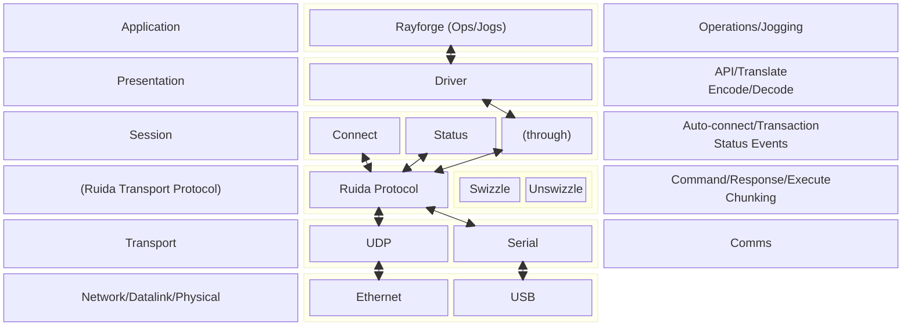

# Introduction
This document provides an overview of the Ruida driver for Rayforge. Described are overall structure, Ruida idiosyncrasies and how they are handled, and deviations from the Rayforge behavior (if any).

NOTE: Currently only the X and Y axes are supported. The code is tested using a Ruida RDC6442S controller. Behavior with other controllers is unknown at this time even though many should work as well -- providing the correct swizzle magic number is used.

**IMPORTANT**: Raster engraves involve a huge number of direction changes. To avoid distortion of the resulting images and possible damage to hardware (e.g. breaking teeth off of the belt), an overscan is used to allow for acceleration and deceleration of the laser head. For GRBL machines the amount of overscan needs to be configured in the raster layer. Ruida controller based machines, on the other hand, automatically handle overscan with the amount of overscan determined by the speed of the scan and the vendor's settings for acceleration and deceleration. Because of this the overscan for the raster layer needs to be **set to 0**.

# Structure
This driver conforms, in large part, to the OSI communications model and is structured as follows:

NOTE: Data paths are shown. For simplicity, control and status paths are not shown.

# Presentation/Driver
This layer is the interface between Rayforge and Ruida controllers and uses the _Session_ and _Ruida Transport Protocol_ (RTP) layers to communicate with a Ruida controller. It receives move (jog) and operation requests from Rayforge, translates them into Ruida commands and forwards them to the Ruida controller using the _RTP_ layer. There are two forms:
- Atomic commands -- typically used for jogging (moves)
- Operation commands and blobs -- for running jobs

This layer is responsible for:
- **Translating** Rayforge API calls into corresponding Ruida commands.
- **Relaying** commands and data to and from a Ruida controller using the _Session_ and _RTP_ layers.

This layer conforms to the structure described in: https://rayforge.org/docs/0.22/developer/driver.html

# Session
The _Session_ layer manages connections with Ruida controllers. Ruida controllers typically support two types of physical devices; Ethernet and USB. When disconnected this layer monitors both and automatically connects to one when detected. If both interfaces are available, the USB interface is selected because of slightly better performance characteristics.

For Ethernet the transport protocol is UDP and requires an IP address or host name to connect. For USB the transport protocol is serial and requires a USB device name (e.g. `/dev/ttyUSB0`).

NOTE: For Linux, UDEV rules can be used to create symlinks which will be consistent across sessions. For a symlink to be used it must match the `/dev/tty*` pattern. For example, the symlink name and path for a laser named "Banger" must have a UDEV rule to create a symlink named `/dev/ttyBanger`.

This layer is responsible for:
- **Connection**: Automatic connection using the configured transport protocol (UDP or Serial).
- **Connection monitoring**:  the Ruida controller and signals whether the controller is responding.
- **Auto-connect and reconnect**: Automatically restore a connection or when switching transports.
- **Connection status**: Signal connection status change notifications including:
    - Connecting -- initial connect or when reconnecting.
    - Connected -- ready to communicate with the machine.
    - Connection failure -- a problem with the transport (e.g. could not open port or invalid IP).
- **Machine status**: Poll the Ruida controller to detect when the machine is busy and inform upper layers of status changes which include:
    - Hardware version info (e.g. Card ID).
    - Machine bed size.
    - Machine busy -- moving or running a job.
    - Current head position.

# Ruida Transport Protocol (RTP)
This layer deals with the idiosyncrasies of communication with a Ruida controller and provides a common transport interface regardless of the actual transport layer. This means the upper layers need not know whether they are communicating using a UDP or Serial/USB interface.

This layer is responsible for:
- **Swizzle/unswizzle**: Ruida controllers require a light obfuscation of data which is handled in this layer so that other layers are not concerned with obfuscated data.
- **Checksums**: For UDP transport, each message sent to the Ruida controller must be preceded by a simple checksum.
- **Command/response**: Handling of sequence and timing of sending commands and receiving replies which can be ACKs (UDP only) or, in the case of memory reads, data.
- **Failure notification**: Informs the session layer of timeouts or unexpected replies.
- **Chunking**: Breaking large jobs into transport compatible chunks for transmission to the machine.

# Encoding and Decoding (ruida_transcoder:[RDCEncoder | RDCDecoder])
Jogging commands, machine status monitoring and job execution require translation to and from Ruida controller commands and data formats. The _Driver_ and _Session_ layers in particular need to encode and decode data. Because multiple layers need this capability, this is a separate module.

Two key functions are performed by this module:
 1. **Encoding**: Translating internal functions and data into Ruida commands and data.
 1. **Decoding**: Translating Ruida replies into internal data formats. This is used primarily for reading data from the controller (e.g. memory reads).

The most notable characteristic of Ruida data is that it is transmitted and received in a 7 bit format. Only command bytes, either commands or in replies to commands, have the top bit set. Because of this, data such as integers are transferred as 7 bit values. Large integers are expressed using five bytes making the full range what can be expressed in 35 bits. Two byte values are therefore 14 bits. This module hides the complexity of performing these conversions.

Ruida controllers support a rich set of commands. This implementation includes only those commands necessary to enable using Rayforge with Ruida controllers.

If additional commands are needed a fairly comprehensive list is available available with the [Ruida Protocoal Analyzer](https://github.com/StevenIsaacs/ruida-protocol-analyzer). Failing that, more discovery is required.

# Development Plan
Development of this driver involves a number of development iterations as shown below. As development progresses the plan will be updated as needed and completed features will be checked off.

## Iterations

1. UDP Connection (first because can use `tshark` to verify)
	- [x] Create `driver/ruida` directory and add to `driver/__init__.py`
	- [x]  Create `transport/udp.py` and add `udp` to `transport/__init__.py`
	- [x] Create `driver/ruida/ruida_transport` and implement `connect` logic and tasks/coroutines (using asyncio)
        - [x] Add logic to send a queue of commands to support sending Ruida files.
        - [ ] Add transaction state machine to handle sending data, ACK (UDP only) and reply data dispatch.
    - [ ] Create `driver/ruida/ruida_session`
		- [ ] Implement status monitoring logic and status change events
	- [ ] Test connect/reconnect use cases.
		- [ ] Status monitoring
		- [ ] Connect status updates (send events)
		- [ ] Pull and reconnect cable
	- [ ] Demo video for iteration on streamable.
2. USB Connection
	- [ ] Add `purge` method to `serial.py` (and other transports?) -- needed for resync of comms
    - [x] Add ability to use symlink device names to `transport/serial.py`
	- [ ] Add USB to code from *UDP Connection* iteration.
	- [ ] Test connect/reconnect use cases.
		- [ ] Status monitoring
		- [ ] Connect status updates (send events)
		- [ ] Pull and reconnect cable (may need USB list change to allow UDEV symlinks)
		- [ ] Test switching between UDP and USB.
	- [ ] Demo video for iteration on streamable.
3. Jogging
	- [ ] Rel vrs abs moves.
	- [ ] Rapid moves
	- [ ] Demo video for iteration on streamable.
4. Running Jobs -- Cut and Engrave
	- [ ] Job file structure
		- [ ] Head and tail (with checksum)
		- [ ] Layers
	- [ ] Cut/engrave moves
	- [ ] Speed settings
	- [ ] Power settings
		- [ ] Min/max for corner decel/accel (may require upper layer support)
	- [ ] Assume 20KHz frequency for time being
	- [ ] Job running status updates
	- [ ] Demo video for iteration on _streamable_.
5. Running Jobs -- Raster and Fill
	- [ ] Horizontal
	- [ ] Vertical
	- [ ] Add dynamic frequency settings
	- [ ] Demo video for iteration on streamable.
6. Running Multi-layer and Multi-step Jobs -- Ready for Beta
7. Human Readable Ruida Commands (for use in side panel)
8. Save to`.rd` File (round trip support)
9. Sync Simulator to Click in Side Panel (like G-Code currently does)
10. Final Signoff and Release

# Credit Where Credit is Due
This work is possible because of the hard work of others.

 - MeerK40t: https://github.com/meerk40t/meerk40t/tree/main/meerk40t/ruida
 - Ruida protocol: https://edutechwiki.unige.ch/en/Ruida
 - [Ruida Protocoal Analyzer](https://github.com/StevenIsaacs/ruida-protocol-analyzer)

 And, of course, Rayforge itself for providing the framework which greatly simplified the structure of this driver.
